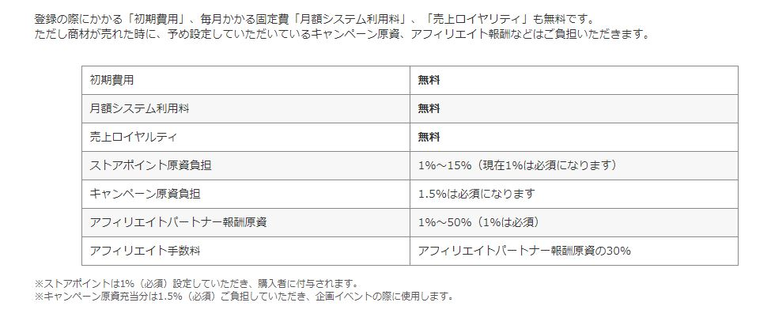
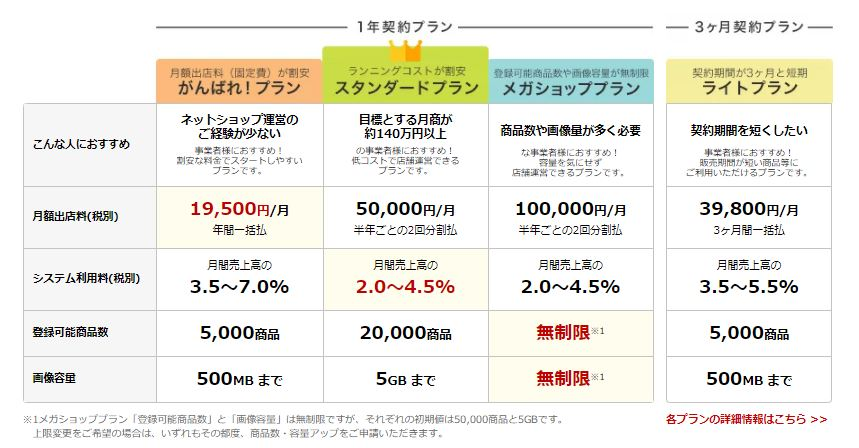

# 店铺代理运营

乐天和雅虎作为店铺式运营的代表，有着高度的自由性，如何创造一个让人流连忘返的店铺，不仅需要对日本文化的了解、消费者的心理、还有潮流的把控。

* \*\*\*\*[**雅虎平台开设店铺费用**](https://business-ec.yahoo.co.jp/shopping/cost/)\*\*\*\*

* \*\*\*\*[**乐天平台开设店铺费用**](https://www.rakuten.co.jp/ec/plan/?l-id=PC_common_navi_to_plan)\*\*\*\*

* **服务费用**

| 费用类型 | 费用科目 | 金额 |
| :--- | :--- | :--- |
| 服务费用 | 乐天、雅虎店铺代运营 | 月营业额7%/月 |
| 特约费用 | 店铺定制装修 | 500円/页面 |
| 特约费用 | 专业商品拍照 | 500円/张 |
| 特约费用 | 月间订单情况分析报告 | 5000円/份 |

