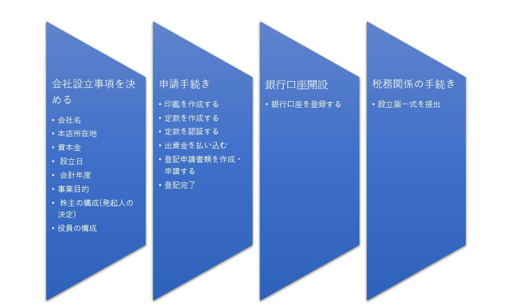

# 公司代理运营

在日本注册公司法人，是迈向本土化运营的里程碑。在店铺运营、企业品牌方面有着极为重要的作用。

* **注册费用（单次）**

| 费用类型 | 费用科目 | 金额 |
| :--- | :--- | :--- |
| 固定费用 | 定款印紙代 | 40,000円 |
| 固定费用 | 定款認証手数料 | 52,000円 |
| 固定费用 | 登録免許税 | 150,000円 |
| 固定费用 | 登記謄本 | 600円/通 |
| 固定费用 | 印鑑証明書 | 450円/通 |
| 固定费用 | 代理费用 | 20,000円 |
| 固定费用 | 地址租赁费用 | 20,000円 |
| 服务费用 | 印鑑作成（会社実印、角印、ゴム印、銀行印） | 25,000円 |
| 服务费用 | 交通费 | 3000円 |

* **运营费用**

| 费用类型 | 费用科目 | 金额 |
| :--- | :--- | :--- |
| 固定费用 | 地址租赁费用 | 20,000円/月 |
| 固定费用 | 事項の変更/商号変更/本店の移転/事業目的の変更 | 30,000円/件 |
| 固定费用 | 登記謄本 | 600円/通 |
| 固定费用 | 印鑑証明書 | 450円/通 |
| 固定费用 | 会计/决算/申报 | 600,000円/年 |
| 固定费用 | 法人税 | 所得额800万以下15%，800万以上23.9% |
| 固定费用 | 法人住民税 | 法人税割+均等割 |
| 固定费用 | 法人事業税 |  |
| 固定费用 | 地方法人税 |  |
| 固定费用 | 消費税 |  |
| 固定费用 | 印紙税 |  |
| 固定费用 | 登録免許税 |  |
| 固定费用 | 固定資産税 |  |
| 服务费用 | 雇佣专用税理士 | 20,000円/月 |
| 服务费用 | 服务费/交通费 | 3000円/月 |

* **商标注册（单次）**

| 费用类型 | 费用科目 | 金额 |
| :--- | :--- | :--- |
| 固定费用 | 商標登録特許印紙 | 12,000円 |
| 固定费用 | 電子化料金 | 1,900円（基本料金1,200円+700/枚） |
| 费用类型 | 服务费/交通费 | 3000円 |
| 费用类型 | 汇款手续费（郵貯） | 203円 |

