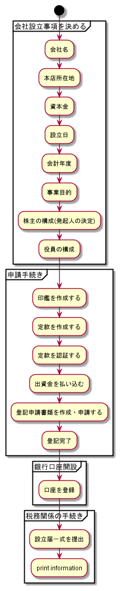

# 公司代理运营

在日本注册公司法人，是迈向本土化运营的里程碑。在店铺运营、企业品牌方面有着极为重要的作用。

* 注册费用

| 费用类型 | 费用科目 | 金额 |
| :--- | :--- | :--- |
| 固定费用 | 定款印紙代 | 40,000円 |
| 固定费用 | 定款認証手数料 | 52,000円 |
| 固定费用 | 登録免許税 | 150,000円 |
| 固定费用 | 登記謄本 | 600円/通 |
| 固定费用 | 印鑑証明書 | 450円/通 |
| 固定费用 | 代理费用 | 20000円｜ |
| 固定费用 | 地址租赁费用 | 20000円 |
| 服务费用 | 印鑑作成 | 25000円 |
| 服务费用 | 交通费 | 3000円 |

